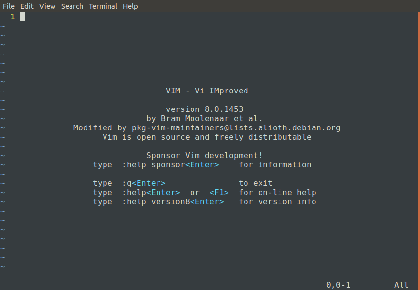

# A Complete Introduction to Vim

So, you've decided you want to use vim. Vim is a powerful text editor,
leveraging its lack of a gui and its ability to be controlled entirely from
the keyboard to perform some wonderful things.

However, this ability comes at the expense of being counterintuitive to use.
The question on Stack Overflow asking how to exit vim has nearly [2 million
views](https://stackoverflow.com/questions/11828270/how-to-exit-the-vim-editor),
not to mention [the](https://www.reddit.com/r/ProgrammerHumor/comments/7nichg)
[memes](https://goo.gl/wo1cG1) and
[jokes](https://opensource.com/article/17/6/5-totally-incorrect-ways-exit-vim)
which have formed.

The first thing to do is open vim. Start a terminal and type in the command
`vim`. You should see something that looks like this:

It's tempting to immediately begin typing to write out a document, like you
would on any gui-based text editor (gedit, notepad++, etc.), but resist the
temptation, because Vim isn't in the right mode.

Vim has three main modes which you need to know about now:
 * **Insert Mode:**
   This mode allows you to type text and add it to the document, like one
   would in a GUI-based editor.

 * **Normal Mode:**
   This mode allows you to easily switch between modes, quickly navigate the
   document, and do most document-modifying commands (cut, paste, etc.).
   Vim opens into this mode by default.

 * **Command-Line Mode:**
   This mode allows you to type out a vim command and have it execute. This is
   where you save your work, switch documents, change vim's behavior, etc.

There are other modes, but these three are the most important.

The easiest way to enter insert mode is to press `i` (short for insert). You
should now see `-- INSERT --` at the bottom left of the screen. This means that
you're in insert mode. From here, you can type out as much or as little text as
you want. To move the cursor, you can use the arrow keys, just like you would
in a gui-based text editor. When you're done typing text to the document, press
`<Esc>` to return to normal mode.

To enter command-line mode, press `:`. You should now see a colon in the bottom
left corner of the screen, and the cursor should be directly to the right of
that.

To save your work, type `w<Enter>`. However, you'll see an error `E32: No file
name`, because you didn't open a file. To fix this, type `:w file.txt<Enter>`,
where file.txt is the name of the file you want to save it to, and vim will
save the document to that location.

To exit vim, type `:q<Enter>`. If you have saved your current document, then
vim will exit for you. However, if your document has unsaved changed, then it
will not quit and will give you the error message, `E37: No write since last
change (add ! to override)`. As the error message says, you can give the
command `:q!` to override that error and exit with unsaved changes.

You may also combine the two previous commands, and give `:wq` to save your
file and then exit vim.

If you want to edit an existing file in vim, you can type `vim file.txt`, into
your terminal, where file.txt is the name of the file you want to edit. This
will open vim to that file by default, and you can change the file however you
want and then give it the `:w` command to save that file.

If you're already in vim and want to edit a different file, you can type the
command, `:e file.txt`, where file.txt is the name of the file you wish to
edit, and vim will close the file that you're currently working on and open the
other file (replace `e` with `e!` if you wish to discard unsaved changes).

So now you know the very basics of vim. You know how to open an existing file,
insert text into a file, save your progress, and exit vim.

For the next chapter, you can read up on
[how to use normal mode](./navigating-normal-mode.md), which is one of the
tools that makes vim so popular, or you can read up on vim commands (not
written yet).

